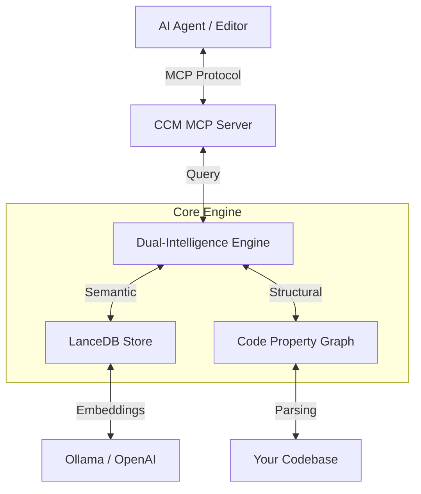

# Cognitive Codebase Matrix (CCM)

> **🧠 The Neural Backbone for Autonomous AI Agents**
>
> **Bridge the gap between your codebase and your AI editor.** CCM transforms static source code into a dynamic, queryable Knowledge Graph, enabling AI agents to navigate, understand, and reason about your project with surgical precision.

[](https://www.rust-lang.org/)
[](https://modelcontextprotocol.io/)
[](https://github.com/senoldogann/LLM-Context-Manager)
[](LICENSE)

---

## 🚀 Why CCM?

Modern AI coding assistants (Claude, Cursor, Windsurf) are powerful, but they suffer from **blindness**:
1.  **Context Limits:** They can't "see" your entire 100,000-line project at once.
2.  **Hallucination:** Without structure, they guess dependencies and imports.
3.  **Lost in Translation:** Traditional vector search finds *similar words*, not *connected logic*.

**CCM gives your AI a map.**
Instead of feeding raw text, CCM provides a **Dual-Intelligence Engine**:
*   **Vector Search (Semantic):** "Find code related to authentication."
*   **Graph Navigator (Structural):** "Who calls `login()`? What does it return? Show me the interface."

It turns your AI from a *text predictor* into a **Senior Architect**.

---

## ✨ Key Features

### 🧠 Connected Intelligence (Graph Navigator)
CCM doesn't just read files; it understands **relationships**.
*   **Two-Pass Indexing:** Automatically links function definitions to their call sites.
*   **Deep Traversal:** Ask "Who calls this?" or "Where is this defined?" and get 100% accurate structural answers.

### ⚡ High-Performance Core
Built entirely in **Rust** for blazing speed.
*   **Batch Embedding:** Indexes thousands of lines in seconds using concurrent batch processing.
*   **LanceDB Integration:** State-of-the-art vector storage for millisecond-latency queries.
*   **Tree-sitter Parsing:** Robust AST analysis for Rust, Python, TypeScript, and JavaScript.

### 🔌 Universal Compatibility (MCP)
Fully implements the **Model Context Protocol (MCP)**.
*   **Plug & Play:** Works instantly with **Antigravity**, **Claude Desktop**, **Zed**, and any MCP-compliant agent.
*   **Auto-Indexing:** Just open your project. CCM handles the rest in the background.

---

## 📦 Installation

### One-Click Setup (Recommended)
Calculates your OS, installs dependencies (Rust, Ollama), and configures everything automatically.

```bash
curl -sSL https://raw.githubusercontent.com/senoldogann/LLM-Context-Manager/main/install.sh | bash
```
*(Requires macOS or Linux. Windows users via WSL.)*

### Manual Build
```bash
git clone https://github.com/senoldogann/LLM-Context-Manager.git
cd LLM-Context-Manager
cargo build --release
```

---

## 🛠️ Configuration

CCM uses a global configuration file. You don't need to configure it per project.

1.  **Create the config directory:**
    ```bash
    mkdir -p ~/.ccm
    ```

2.  **Create `~/.ccm/.env`:**
    
    **Option A: Local Privacy (Ollama) - _Recommended_**
    ```ini
    EMBEDDING_PROVIDER=ollama
    EMBEDDING_HOST=http://127.0.0.1:11434
    EMBEDDING_MODEL=mxbai-embed-large
    # MAX_TOKENS=1000  # distinct from compilation time limit, optional
    ```

    **Option B: Cloud Power (OpenAI)**
    ```ini
    EMBEDDING_PROVIDER=openai
    EMBEDDING_API_KEY=sk-your-key-here
    EMBEDDING_MODEL=text-embedding-3-small
    ```

---

## 🚀 Workflow: Indexing Your Projects

Before your AI can "see" a project, you must index it. This creates a local `data/` folder inside that project.

**To index a new project:**

```bash
ccm-cli index --path /absolute/path/to/my-new-project
```

*   Running this command scans the project, generates embeddings, and saves them to `/path/to/my-new-project/data/ccm_db`.
*   You only need to re-run this if code changes significantly (incremental indexing coming soon).

---

## 🤖 Integration Guide (MCP)

CCM exposes an **MCP Server** that connects your AI editor (Cursor, Claude Desktop, etc.) to your indexed projects.

### 1. Locate Config File
*   **Antigravity:** `~/.gemini/antigravity/mcp_config.json`
*   **Claude Desktop:** `~/Library/Application Support/Claude/claude_desktop_config.json`

### 2. Add Server Entry
Add this to your `mcpServers` object. Note that we point to the release binary directly.

```json
{
  "mcpServers": {
    "context-manager": {
      "command": "/Users/YOUR_USER/.cargo/bin/ccm-mcp",
      "args": [],
      "env": {
        "RUST_LOG": "info"
       }
    }
  }
}
```
*(Replace `/Users/YOUR_USER` with your actual home directory path, e.g. `/Users/dogan`)*

### 3. Usage in AI
Once connected, the AI has three powerful tools:

*   **`get_context`**: Reads file content with intelligent range windowing.
*   **`search_code`**: Semantic search across your codebase.
*   **`read_graph`**: Navigates the structural call graph.

**Multi-Project Support:**
The tools accept an optional `project_path` argument. You can simply tell your AI:
> "Search for 'auth logic' in my /Users/me/projects/other-app project"

If you don't specify a project, it defaults to the directory where the MCP server was launched (or empty). For best results, explicit paths are recommended when working with multiple repos.

---

## 🏗️ Architecture

CCM operates as a sidecar process to your editor.



---

## 🧩 Supported Languages

| Language | Extensions | Features |
|:---|:---|:---|
| **Rust** | `.rs` | Full AST, Call Graph, Struct/Impl |
| **Python** | `.py` | Classes, Functions, Imports |
| **TypeScript** | `.ts`, `.tsx` | Interfaces, Types, Functions |
| **JavaScript** | `.js`, `.jsx` | Functions, ES6 Classes |

---

## ❓ Troubleshooting

### "No context found" Error
If `get_context` returns no results:
1.  **Index Your Codebase:** Run `ccm-cli index --path .` at least once.
2.  **Check Empty Lines:** CCM maps functions/classes. Querying a blank line (e.g., between functions) returns nothing by design.
3.  **Project Root:** Ensure the `CCM_PROJECT_ROOT` in your MCP config matches the directory you indexed.

### "Semantic Match" Generic Titles
If search results lack function names:
*   Ensure you are using the latest version (v0.1.0+). Older versions had an ID-mismatch bug.


## 📄 License

Designed for the community. Open source under the **MIT License**.

Built with ❤️ in **Rust**.
