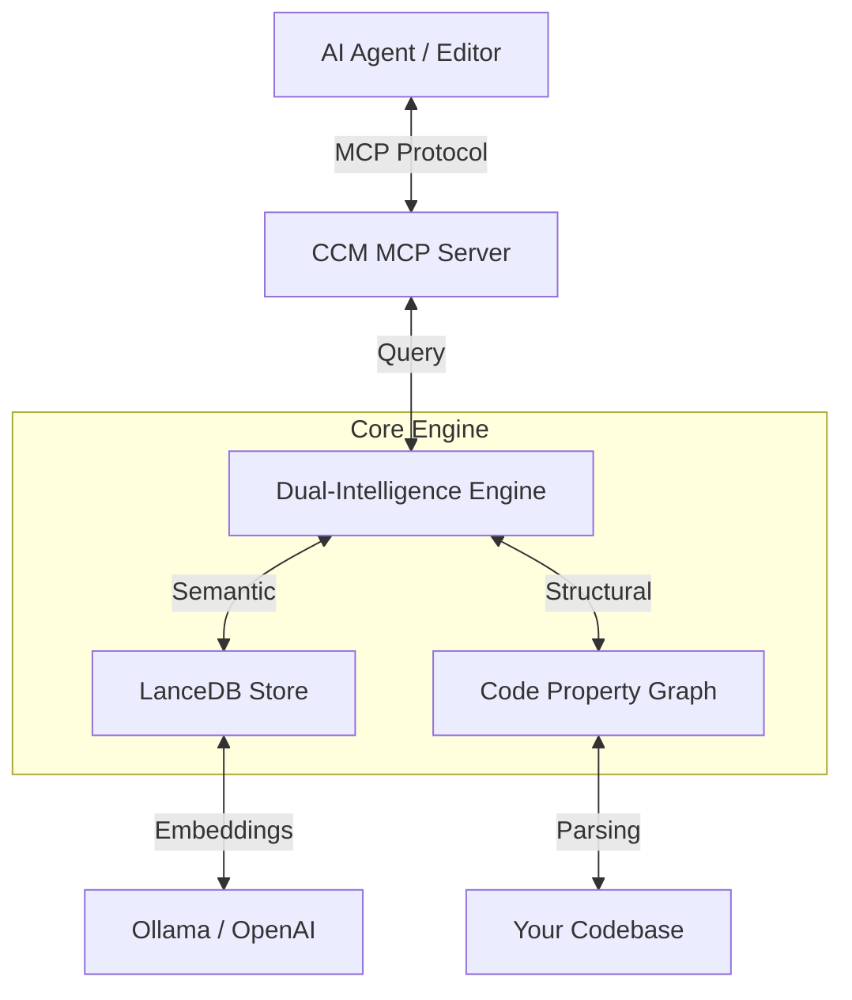

# Cognitive Codebase Matrix (CCM)

> **🧠 The Neural Backbone for Autonomous AI Agents**
>
> **Bridge the gap between your codebase and your AI editor.** CCM transforms static source code into a dynamic, queryable Knowledge Graph, enabling AI agents to navigate, understand, and reason about your project with surgical precision.

[](https://www.rust-lang.org/)
[](https://modelcontextprotocol.io/)
[](https://github.com/senoldogann/LLM-Context-Manager)
[](LICENSE)

---

## 🚀 Why CCM?

Modern AI coding assistants (Claude, Cursor, Windsurf) are powerful, but they suffer from **blindness**:
1.  **Context Limits:** They can't "see" your entire 100,000-line project at once.
2.  **Hallucination:** Without structure, they guess dependencies and imports.
3.  **Lost in Translation:** Traditional vector search finds *similar words*, not *connected logic*.

It turns your AI from a *text predictor* into a **Senior Architect**.

### 🛠️ The "Agent-First" Difference
Unlike other tools that just dump raw code, CCM injects **AI-Optimized Context**. Every piece of code retrieved includes:
*   **Logical Reasoning:** CCM explains *why* it picked that code (e.g., "Structurally related to your cursor" or "Caller of the current function").
*   **Relational Edges:** It maps how different files talk to each other, so the AI doesn't have to guess.


---

## ✨ Key Features

### 🧠 Connected Intelligence (Graph Navigator)
CCM doesn't just read files; it understands **relationships**.
*   **Two-Pass Indexing:** Automatically links function definitions to their call sites.
*   **Deep Traversal:** Ask "Who calls this?" or "Where is this defined?" and get 100% accurate structural answers.

### ⚡ High-Performance Core
Built entirely in **Rust** for blazing speed.
*   **Batch Embedding:** Indexes thousands of lines in seconds using concurrent batch processing.
*   **LanceDB Integration:** State-of-the-art vector storage for millisecond-latency queries.
*   **Tree-sitter Parsing:** Robust AST analysis for Rust, Python, TypeScript, and JavaScript.

### 🔌 Universal Compatibility (MCP)
Fully implements the **Model Context Protocol (MCP)**.
*   **Plug & Play:** Works instantly with **Antigravity**, **Claude Desktop**, **Zed**, and any MCP-compliant agent.
*   **Auto-Indexing:** Just open your project. CCM handles the rest in the background.
*   **Zero-Config:** Automatically detects your project root from the current working directory. Explicit configuration is optional.

---

## 📦 Installation

### ⚡ Automatic Setup (via npx) - *Recommended*
If you have Node.js installed, this is the easiest way to get started. It automatically handles binary downloads and configures your editor.

```bash
# 1. AUTO-CONFIGURE your AI editor (Claude, Antigravity, Cursor, Cline, etc.)
npx @senoldogann/context-manager install

# 2. Index your current project
npx @senoldogann/context-manager index --path .
```
*Handles cross-platform binary downloads automatically.*

---

### One-Click Shell Setup (Legacy)
Installs binaries globally to your system via Cargo.
```bash
curl -sSL https://raw.githubusercontent.com/senoldogann/LLM-Context-Manager/main/install.sh | bash
```
*(Requires macOS or Linux. Windows users via WSL.)*

### Manual Build (Development)
```bash
git clone https://github.com/senoldogann/LLM-Context-Manager.git
cd LLM-Context-Manager
cargo build --release
```

---

## 🛠️ Configuration

CCM uses a global configuration file. You don't need to configure it per project.

1.  **Create the config directory:**
    ```bash
    mkdir -p ~/.ccm
    ```

2.  **Create `~/.ccm/.env`:**
    
    **Option A: Local Privacy (Ollama) - _Recommended_**
    ```ini
    EMBEDDING_PROVIDER=ollama
    EMBEDDING_HOST=http://127.0.0.1:11434
    EMBEDDING_MODEL=mxbai-embed-large
    # MAX_TOKENS=1000  # distinct from compilation time limit, optional
    ```

    **Option B: Cloud Power (OpenAI)**
    ```ini
    EMBEDDING_PROVIDER=openai
    EMBEDDING_API_KEY=sk-your-key-here
    EMBEDDING_MODEL=text-embedding-3-small
    ```

---

## 🚀 Workflow: Indexing Your Projects

Before your AI can "see" a project, you must index it. This creates a local `data/` folder inside that project.

**To index a new project:**

```bash
npx @senoldogann/context-manager index --path .
```

### 👀 Watch Mode (Automatic Re-indexing)
If you want CCM to automatically update the index whenever you save a file, use the `--watch` flag:

```bash
npx @senoldogann/context-manager index --path . --watch
```
*   This scans the project and monitors for changes in `.rs`, `.py`, `.ts`, `.js`, `.tsx`, and `.jsx` files.
*   It uses an intelligent debounce to prevent excessive indexing during rapid edits.

---

## 🤖 Integration Guide (MCP)

CCM uses a **state-of-the-art MCP Server** that works without complex per-project configuration.

### 1. Automatic Setup (Simple)
Open your terminal and run:
```bash
npx @senoldogann/context-manager install
```
This will automatically detect and update your config files for Claude, Antigravity, Cursor, Cline, and Roo Code.

### 2. Manual Configuration (Advanced)
If you prefer to configure it manually, add the following entry to your `mcp_config.json`. This uses `npx` to ensure you always run the version compatible with your project:

```json
{
  "mcpServers": {
    "context-manager": {
      "command": "npx",
      "args": [
        "-y",
        "@senoldogann/context-manager",
        "mcp"
      ],
      "env": {
        "RUST_LOG": "info"
       }
    }
  }
}
```
> [!NOTE]
> If you installed via the shell script or built from source, you can use `"command": "ccm-mcp"` directly if it's in your PATH.


### 3. Usage in AI
The AI has three main tools to understand your code:

*   **`search_code`**: Semantic search ("Find where we handle auth").
*   **`read_graph`**: Structural navigation ("Who calls this function?").
*   **`get_context`**: Intelligent code reading.

---

## 🎯 Best Practices & Prompting

To get the most out of CCM, follow the **Search → Navigate → Read** workflow.

### 💡 Pro Tips for Users
If the AI gives a "Node not found" error, it's likely trying to guess IDs. Guide it with these prompts:

**Good Sample Prompts:**
*   "First, **search for code** related to repository management in the `mywebsiterepo` project. Then, pick the most relevant service and **read its graph** to show me its callers."
*   "Analyze the `authService.ts` file. Show me its internal structure and then find where these methods are used across the project."
*   "Find all implementations of the `ImpactAnalysis` interface and explain how they connect to the main dashboard."

### 🔧 For AI Agents (Guidelines)
1.  **Never Guess IDs:** Always use `search_code` first to retrieve valid `node_id`s from the results.
2.  **Trust the Reason:** Pay attention to the `Reason` field in the context results—it explains the structural or semantic link.
3.  **Explicit Paths:** When the user has multiple projects open, always include the `project_path` in your tool calls.
4.  **Context Mapping:** Use `read_graph` to understand *why* a piece of code exists (who depends on it) before suggesting changes.

---

### 💡 Pro-Tip: Enforcing CCM Usage
To ensure your AI agent (Claude, Cursor, etc.) always uses CCM for deep analysis, add this to your **Custom Instructions** or **System Prompt**:

> "You are an expert architect. For any question about the codebase, DO NOT guess. Use the `context-manager` tools to explore the Graph and Vector store. Always prioritize `search_code` to find entry points and `read_graph` to navigate dependencies before proposing any code changes."


---

**Pro-Tip: Multi-Project Workflows**
The tools automatically detect the current project context from your editor. If you are working across multiple repositories, the AI can query any indexed project by path.

---

## 🏗️ Architecture

CCM operates as a sidecar process to your editor.



---

## 🧩 Supported Languages

| Language | Extension | Analysis Depth |
| :--- | :--- | :--- |
| **Rust** | `.rs` | Full AST (Functions, Structs, Impls) |
| **Python** | `.py` | Full AST (Functions, Classes) |
| **TypeScript / JS** | `.ts, .js, .tsx, .jsx` | Full AST (Classes, Functions) |
| **Markdown** | `.md` | Full File Indexing |
| **JSON** | `.json` | Full File Indexing |
| **YAML / TOML** | `.yaml, .yml, .toml` | Full File Indexing |
| **JavaScript** | `.js`, `.jsx` | Functions, ES6 Classes |

---

## ❓ Troubleshooting

### "No context found" Error
If `get_context` returns no results:
1.  **Index Your Codebase:** Run `ccm-cli index --path .` at least once.
2.  **Check Empty Lines:** CCM maps functions/classes. Querying a blank line (e.g., between functions) returns nothing by design.
3.  **Project Root:** Ensure the `CCM_PROJECT_ROOT` in your MCP config matches the directory you indexed.
4.  **Path Mismatch:** If you are using an older version, absolute paths might fail. **Update to v0.1.7+** (or use the latest dev build) which includes automatic path normalization.

### "Semantic Match" Generic Titles
If search results lack function names:
*   Ensure you are using the latest version (v0.1.0+). Older versions had an ID-mismatch bug.


## 📄 License

Designed for the community. Open source under the **MIT License**.

Built with ❤️ in **Rust**.

---

# Cognitive Codebase Matrix (CCM) - Türkçe

> **🧠 Otonom Yapay Zeka Ajanları için Nöral Omurga**
>
> **Kod tabanınız ile yapay zeka editörünüz arasındaki boşluğu doldurun.** CCM, statik kaynak kodunu dinamik ve sorgulanabilir bir Bilgi Grafiğine (Knowledge Graph) dönüştürerek yapay zeka ajanlarının projeniz içinde cerrahi bir hassasiyetle gezinmesini, anlamasını ve akıl yürütmesini sağlar.

## 🚀 Neden CCM?

Modern yapay zeka kodlama asistanları (Claude, Cursor, Windsurf) güçlüdür ancak **"görüş kısıtlılığı"** sorunu yaşarlar:
1.  **Bağlam Limitleri:** 100.000 satırlık projenizin tamamını aynı anda "göremezler".
2.  **Halüsinasyon:** Yapısal bilgi olmadan, bağımlılıkları ve import'ları tahmin etmeye çalışırlar.
3.  **Kaybolan Anlam:** Geleneksel vektör araması sadece *benzer kelimeleri* bulur, *bağlantılı mantığı* değil.

**CCM, yapay zekanıza bir harita verir.**
Yapay zekanızı bir *metin tahmincisi* olmaktan çıkarıp bir **Kıdemli Mimar (Senior Architect)** haline getirir.

### 🛠️ "Ajan Öncelikli" Fark
CCM, sadece ham kod yığını sunmak yerine **Yapay Zeka için Optimize Edilmiş Bağlam** enjekte eder. Getirilen her kod parçası şunları içerir:
*   **Mantıksal Muhakeme (Reasoning):** CCM, o kodu neden seçtiğini açıklar (örn. "İmlecinizle yapısal olarak ilgili" veya "Mevcut fonksiyonu çağıran yer").
*   **İlişkisel Bağlar (Edges):** Farklı dosyaların birbirleriyle nasıl konuştuğunu haritalandırır, böylece yapay zeka tahmin yürütmek zorunda kalmaz.

## ✨ Öne Çıkan Özellikler

### 🧠 Bağlantılı Zeka (Graph Navigator)
CCM sadece dosyaları okumaz; **ilişkileri** anlar.
*   **İki Aşamalı Endeksleme:** Fonksiyon tanımlarını otomatik olarak çağrıldıkları yerlere bağlar.
*   **Derin Gezinme:** "Bunu kim çağırıyor?" veya "Bu nerede tanımlanmış?" diye sorun ve %100 doğru yapısal yanıtlar alın.

### ⚡ Yüksek Performanslı Çekirdek
Tamamen **Rust** ile geliştirilmiştir.
*   **Toplu Gömme (Batch Embedding):** Eşzamanlı işleme ile binlerce satırı saniyeler içinde endeksler.
*   **LanceDB Entegrasyonu:** Milisaniye gecikmeli sorgular için modern vektör depolama.
*   **Tree-sitter Ayrıştırma:** Rust, Python, TypeScript ve JavaScript için sağlam AST analizi.

### 🔌 Evrensel Uyumluluk (MCP)
**Model Context Protocol (MCP)** standartlarını tam olarak uygular.
*   **Tak ve Çalıştır:** Antigravity, Claude Desktop, Zed ve diğer tüm MCP uyumlu ajanlarla anında çalışır.
*   **Otomatik Endeksleme:** Projenizi açmanız yeterli, CCM arka planda her şeyi halleder.
*   **Sıfır Yapılandırma:** Proje kök dizinini otomatik olarak algılar.

## 📦 Kurulum

### ⚡ Otomatik Kurulum (npx ile) - *Önerilen*
Node.js yüklüyse, başlamanın en kolay yolu budur. Binary'leri otomatik indirir ve editörünüzü yapılandırır.
```bash
# 1. AI Editörünüzü (Claude, Antigravity, Cursor, Cline, etc.) otomatik yapılandırın
npx @senoldogann/context-manager install

# 2. Mevcut projenizi endeksleyin
npx @senoldogann/context-manager index --path .
```

## 🚀 İş Akışı: Projeleri Endeksleme

Yapay zekanın bir projeyi "görebilmesi" için önce onu endekslemeniz gerekir. Bu, projenin içinde yerel bir `data/` klasörü oluşturur.

```bash
npx @senoldogann/context-manager index --path .
```

### 👀 İzleme Modu (Otomatik Yeniden Endeksleme)
Dosya her kaydedildiğinde CCM'in endeksi otomatik olarak güncellemesini istiyorsanız `--watch` bayrağını kullanın:
```bash
npx @senoldogann/context-manager index --path . --watch
```

## 🤖 Entegrasyon Rehberi (MCP)

### 1. Kullanım
Yapay zeka, kodunuzu anlamak için üç ana araca sahiptir:
*   **`search_code`**: Semantik arama ("Auth nerede işleniyor bul").
*   **`read_graph`**: Yapısal gezinme ("Bu fonksiyonu kimler çağırıyor?").
*   **`get_context`**: Akıllı kod okuma.

### 2. Manuel Yapılandırma (Gelişmiş)
Eğer manuel yapılandırmayı tercih ederseniz, `mcp_config.json` dosyanıza aşağıdaki girişi ekleyin. Bu yöntem `npx` kullanarak her zaman projenizle uyumlu versiyonun çalışmasını sağlar:

```json
{
  "mcpServers": {
    "context-manager": {
      "command": "npx",
      "args": [
        "-y",
        "@senoldogann/context-manager",
        "mcp"
      ],
      "env": {
        "RUST_LOG": "info"
       }
    }
  }
}
```
> [!NOTE]
> Eğer binary'leri bir shell betiği ile kurduysanız veya kaynaktan derlediyseniz ve PATH'inizde mevcutsa, doğrudan `"command": "ccm-mcp"` kullanabilirsiniz.

### 💡 İpucu: CCM Kullanımını Zorunlu Kılma
AI asistanınızın (Claude, Cursor vb.) derin analiz için her zaman CCM kullanmasını sağlamak için bunu **Özel Talimatlarınıza (Custom Instructions)** veya **Sistem Komutunuza (System Prompt)** ekleyin:

> "Sen uzman bir mimarsın. Kod tabanı hakkındaki hiçbir soru için tahmin yürütme. Grafiği ve Vektör deposunu keşfetmek için `context-manager` araçlarını kullan. Herhangi bir kod değişikliği önermeden önce her zaman giriş noktalarını bulmak için `search_code` ve bağımlılıkları anlamak için `read_graph` araçlarına öncelik ver."

## 🧩 Desteklenen Diller
Rust (.rs), Python (.py), TypeScript/JS (.ts, .js, .tsx, .jsx), Markdown (.md), JSON (.json), YAML/TOML (.yaml, .yml, .toml).

## 📄 Lisans
Topluluk için tasarlandı. **MIT Lisansı** altında açık kaynaktır.

Rust ile ❤️ kullanılarak inşa edildi.
