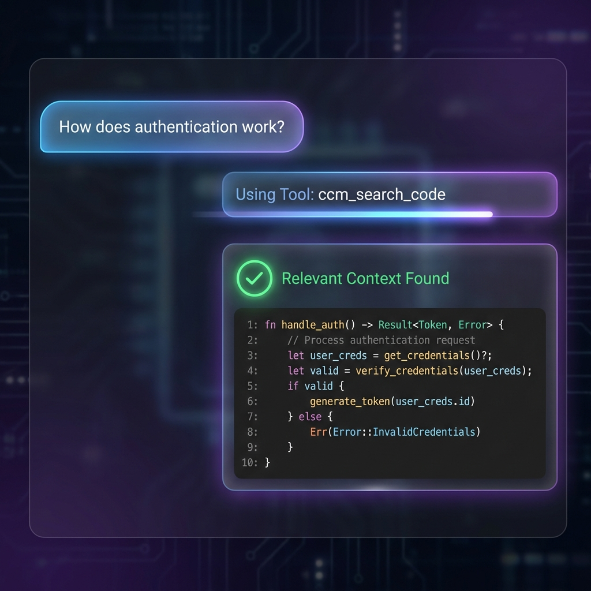

# Cognitive Codebase Matrix (CCM)

> **🧠 Context Provider for AI Agents & LLMs**
>
> CCM is a high-performance, Rust-based system designed to index, understand, and serve codebase context to AI agents. It bridges the gap between raw source code and Large Language Models through graph-based structural analysis and semantic vector search.

[](https://www.rust-lang.org/)
[](https://modelcontextprotocol.io/)
[](LICENSE)

---

## ❓ Neden CCM? (Why CCM?)

Günümüzün AI agentları (Cursor, Windsurf, Claude vb.) harika kod yazıyor, **ancak projeler büyüdükçe tıkanıyorlar.**

1.  **Context Window Limiti:** Tüm projenizi her prompt'ta gönderemezsiniz.
2.  **Karışıklık:** Tüm dosyaları gönderseniz bile, model gereksiz detaylarda kaybolur ("Lost in the Middle").
3.  **Ödenen Token:** Gereksiz her satır kod, size zaman ve para kaybı olarak döner.

**CCM bu sorunu çözer:**
Projeniz 1000 dosya da olsa, CCM **sadece o anki sorunuzla ilgili** olan 2-3 dosyayı akıllıca seçer ve AI'a sunar.
- **Bir Junior Developer gibi değil, bir Senior Architect gibi** projenin tamamına hakimdir.
- **Herhangi bir dilde** (Rust, Python, JS...) yazılmış **herhangi bir projeye** anında zeka katar.

---

## Features

- **Dual Intelligence Engine:** Combines **Code Property Graphs (CPG)** for structural understanding with **Vector Embeddings** for semantic retrieval.
- **Universal Context Provider (MCP):** Fully implements the **Model Context Protocol (MCP)** to serve context to any MCP-compliant client (Claude Desktop, Antigravity, Zed, Custom Agents).
- **Plug-and-Play AI:** Supports both **OpenAI** (Cloud) and **Ollama** (Local) for embedding generation.
- **High Performance:** Built with **Rust**, **LanceDB** (Vector Store), and **Tree-sitter** (Parsing).
- **Graph Analysis:** Deep querying of code relationships.
- **🆕 Auto-Indexing:** MCP server automatically indexes the codebase on startup (no manual CLI commands needed).
- **🆕 Chunk-Based Indexing:** Large files are split into overlapping chunks for complete semantic coverage.
- **🆕 Persistent Memory:** Code graph is saved to disk and survives restarts.
- **🆕 Batch Embedding:** Processes 32 chunks per API call for ~10x faster indexing.

---

## Installation

### One-Click Install (Recommended)

The fastest way to get started. This script automatically:
- Installs Rust (if needed)
- Installs Ollama (if needed)
- Builds the project
- Configures environment

```bash
curl -sSL https://raw.githubusercontent.com/senoldogann/LLM-Context-Manager/main/install.sh | bash
```

> **Note:** After installation, restart your terminal or run `source ~/.zshrc` to update your PATH.

---

### Manual Installation

#### Prerequisites

| Requirement | Description |
|-------------|-------------|
| **Rust** | 1.70+ (`curl --proto '=https' --tlsv1.2 -sSf https://sh.rustup.rs \| sh`) |
| **Ollama** | For local embeddings ([ollama.com](https://ollama.com/)) |

#### Build from Source

```bash
# Clone the repository
git clone https://github.com/senoldogann/LLM-Context-Manager.git
cd LLM-Context-Manager

# Build release binaries
cargo build --release

# Binaries will be in target/release/
# - ccm-cli    (Command Line Interface)
# - ccm-mcp    (MCP Server for AI Editors)
```

---

## Configuration

### 1. Environment Setup

Create a `.env` file in the project root:

```bash
# For Local Ollama (Recommended)
EMBEDDING_PROVIDER=ollama
EMBEDDING_HOST=http://127.0.0.1:11434
EMBEDDING_MODEL=mxbai-embed-large
EMBEDDING_API_KEY=ollama
RUST_LOG=info

# For OpenAI (Cloud)
# EMBEDDING_PROVIDER=openai
# EMBEDDING_HOST=https://api.openai.com/v1
# EMBEDDING_MODEL=text-embedding-3-small
# EMBEDDING_API_KEY=sk-your-key-here
```

### 2. Ollama Setup (If Using Local)

```bash
# Start Ollama service
ollama serve

# Pull embedding model
ollama pull mxbai-embed-large
```

---

## Integrating with AI Agents

CCM empowers your AI editor with deep codebase understanding. Instead of manually pasting code, the AI can "search" and "read" your project autonomously.



### How It Works

1. **Ask a Question:** "How is authentication implemented in `auth.rs`?"
2. **AI Uses CCM Tools:** The agent automatically calls `ccm_search_code` or `ccm_get_context`.
3. **Smart Retrieval:** CCM returns the exact function definitions, dependencies, and semantic matches.
4. **Answer:** The AI provides a precise answer based on the retrieved context.

### Why CCM?

As shown in advanced context management strategies:

- **RAG (Retrieval-Augmented Generation):** CCM maps your code to a vector space, allowing the AI to "pull" only the relevant parts dynamically.
- **Hierarchical/Deep Memory:** Unlike simple text search, CCM understands code structure (Call Graphs), enabling it to navigate complex relationships.

> **Note:** Once installed, your AI editor (Claude, Antigravity, etc.) will automatically detect the `context-manager` tools and use them whenever you ask a question about your code.

## Indexing Your Codebase

Before using semantic search, you need to index your codebase. This parses all supported files and creates vector embeddings.

### Index via CLI

```bash
# Index a directory
cargo run -p ccm-cli -- index --path /path/to/your/project

# Or with release binary
./target/release/ccm-cli index --path /path/to/your/project

# Custom database location
./target/release/ccm-cli index --path ./my-project --db-path ./custom_db
```

### Supported Languages

| Language | Extensions |
|----------|------------|
| Rust | `.rs` |
| Python | `.py` |
| TypeScript | `.ts` |
| JavaScript | `.js` |

### Index Output Example

```
╔══════════════════════════════════════╗
║     CCM - Codebase Indexer           ║
╚══════════════════════════════════════╝
Indexing directory: /path/to/project
  ✓ /path/to/project/src/main.rs
  ✓ /path/to/project/src/lib.rs

✓ Indexed 45 nodes from 2 files

═══════════════════════════════════════
Indexing Complete!
  Files indexed: 2
  Files failed:  0
  Nodes created: 45
═══════════════════════════════════════
```

---

---

## 🔌 Integration with AI Clients

CCM exposes a standard **Model Context Protocol (MCP)** server, making it compatible with any MCP-compliant AI editor or agent (e.g., Antigravity, Claude Desktop, Zed, etc).

### 1. Configure the Wrapper

The installation script creates a helper script at `~/.ccm/ccm-mcp-wrapper.sh`. This script manages the environment variables and points to the correct binary.

Ensure `CCM_PROJECT_ROOT` points to the folder you want to index.

### 2. Add to MCP Configuration

Locate your editor's MCP configuration file and add the following entry.

**Example Configuration:**

```json
{
  "mcpServers": {
    "context-manager": {
      "command": "/Users/YOUR_USER/.ccm/ccm-mcp-wrapper.sh",
      "args": [],
      "env": {}
    }
  }
}
```

> **Note:** The configuration file location varies by editor:
> - **Antigravity:** `~/.gemini/antigravity/mcp_config.json`
> - **Claude Desktop:** `~/Library/Application Support/Claude/claude_desktop_config.json`
> - **Other Clients:** Refer to your client's documentation.

### 3. Restart Client

Save the configuration and restart your AI client. The client should now recognize `context-manager` and its tools.

---

## Available Using Tools

| Tool | Description | Parameters |
|------|-------------|------------|
| `get_context` | Get code context for a file and line | `file: string`, `line: integer` |
| `search_code` | Semantic search across codebase | `query: string` |
| `read_graph` | Get details of a code node by ID | `node_id: string` |

### Example Usage in AI Editor

Simply ask your AI assistant:

> *"Search for authentication logic in this codebase"*
> 
> *"Show me the context around line 50 of server.rs"*
> 
> *"What does the RetrievalEngine do?"*

The AI will automatically use the appropriate CCM tool to answer.

---

## Testing

### Manual MCP Test

You can test the MCP server directly via stdin:

```bash
# Start the server and send a test request
echo '{"jsonrpc":"2.0","id":1,"method":"initialize","params":{"protocolVersion":"2025-06-18","capabilities":{},"clientInfo":{"name":"test","version":"1.0"}}}
{"jsonrpc":"2.0","method":"notifications/initialized"}
{"jsonrpc":"2.0","id":2,"method":"tools/list","params":{}}' | ./target/debug/ccm-mcp
```

**Expected Output:**
```json
{"jsonrpc":"2.0","id":1,"result":{"protocolVersion":"2025-06-18",...}}
{"jsonrpc":"2.0","id":2,"result":{"tools":[...]}}
```

### CLI Testing

```bash
# Semantic search
cargo run -p ccm-cli -- query --text "how does authentication work"

# Index a directory (if implemented)
cargo run -p ccm-cli -- index /path/to/codebase
```

---

## Architecture

```
┌─────────────────────────────────────────────────────────────┐
│                    AI Editor (Antigravity/Claude)           │
│                              │                               │
│                         MCP Protocol                         │
│                              ▼                               │
├─────────────────────────────────────────────────────────────┤
│                     ccm-mcp (MCP Server)                     │
│                 JSON-RPC 2.0 over stdio                      │
├─────────────────────────────────────────────────────────────┤
│                       ccm-core (Engine)                      │
│  ┌─────────────────┐    ┌─────────────────────────────────┐ │
│  │   CodeGraph     │    │        LanceDB Store            │ │
│  │   (Petgraph)    │◄──►│  (Vector Embeddings + Search)   │ │
│  │                 │    │                                 │ │
│  │  AST → Nodes    │    │  Ollama/OpenAI → Embeddings     │ │
│  └─────────────────┘    └─────────────────────────────────┘ │
├─────────────────────────────────────────────────────────────┤
│                    Tree-sitter (Parser)                      │
│              Rust │ Python │ TypeScript │ ...               │
└─────────────────────────────────────────────────────────────┘
```

---

## 📁 Project Structure

```
context-manager/
├── core/               # Core library (engine, graph, vector store)
│   └── src/
│       ├── engine.rs   # RetrievalEngine (search, indexing)
│       ├── graph/      # CodeGraph (AST nodes, relationships)
│       ├── vector/     # LanceDB store, embeddings
│       └── parser/     # Tree-sitter integration
├── mcp/                # MCP Server implementation
│   └── src/
│       ├── main.rs     # Entry point (stdio loop)
│       ├── server.rs   # Request handlers
│       ├── protocol.rs # JSON-RPC types
│       └── tools.rs    # Tool implementations
├── cli/                # Command-line interface
├── .env                # Configuration (gitignored)
└── ccm-mcp-wrapper.sh  # MCP wrapper script
```

---

## 🔧 Troubleshooting

### "invalid request" Error in MCP

1. **Check Protocol Version:** CCM uses `2025-06-18`. Ensure your client supports this.
2. **Check Wrapper Script:** Ensure all paths are absolute and the script is executable.
3. **Check Logs:** View `mcp_debug.log` for detailed request/response logs.

### Embedding Errors

1. **Ollama Not Running:** Start with `ollama serve`
2. **Model Not Found:** Pull with `ollama pull mxbai-embed-large`
3. **Connection Refused:** Check `EMBEDDING_HOST` in `.env`

---

## 📄 License

MIT License - See [LICENSE](LICENSE) for details.

---

## 🤝 Contributing

Contributions are welcome! Please open an issue or submit a pull request.

---

**Built with ❤️ in Rust**
