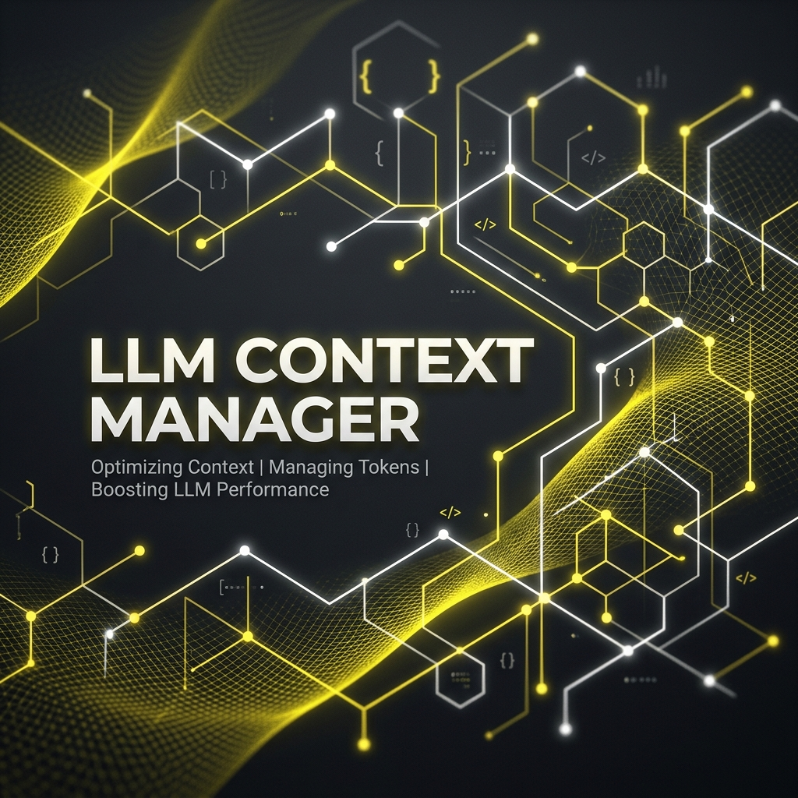

# Cognitive Codebase Matrix (CCM)

<p align="center">
  
</p>

English | [Turkce](./README.tr.md)

> **🧠 The Neural Backbone for Autonomous AI Agents**

> Bridge the gap between your codebase and your AI editor. CCM transforms static source code into a dynamic, queryable Knowledge Graph, enabling AI agents to navigate, understand, and reason about your project with surgical precision.

[](https://www.rust-lang.org/)
[](https://modelcontextprotocol.io/)
[](https://github.com/senoldogann/LLM-Context-Manager)
[](LICENSE)
[](SKILL.md)

---

## Why CCM?

Modern AI coding assistants (Claude, Cursor, Windsurf) are powerful but suffer from **blindness**:

| Problem | Impact |
|---------|--------|
| **Context Limits** | Can't "see" your entire 100,000-line project |
| **Hallucination** | Guesses dependencies without structure |
| **Lost Context** | Vector search finds *similar words*, not *connected logic* |

CCM turns your AI from a *text predictor* into a **Senior Architect**.

### The "Agent-First" Difference

Unlike tools that dump raw code, CCM injects **AI-Optimized Context**:

- **Logical Reasoning** - Explains *why* code was retrieved
- **Relational Edges** - Maps how files talk to each other
- **Confidence Scores** - Shows certainty in results

---

## Key Features

### 🧠 Connected Intelligence (Graph Navigator)
- **Two-Pass Indexing** - Links function definitions to call sites
- **Deep Traversal** - Ask "Who calls this?" and get accurate answers

### ⚡ High-Performance Core
- **Rust-Powered** - Blazing fast indexing and queries
- **Batch Embedding** - Thousands of lines in seconds
- **LanceDB** - Millisecond-latency vector storage
- **Tree-sitter** - Robust AST for Rust, Python, TypeScript, Go, Java, Kotlin, C#

### 🔒 Production Hardening
- **Binary Checksums** - Release artifacts include `checksums.txt` for integrity
- **MCP Allowlist** - Restrict project access with `CCM_ALLOWED_ROOTS`
- **Safe Defaults** - Configurable timeouts and file-size limits

### 🔌 Universal Compatibility (MCP)
- **Plug & Play** - Installer configures Codex, Cursor, Claude Desktop, and Antigravity
- **Lazy Indexing** - Auto-indexes on first query
- **Zero-Config** - Auto-detects project root

---

## Installation

### ⚡ Automatic (Recommended)

```bash
# 1. Configure MCP for your AI editor
npx @senoldogann/context-manager install

# 2. Index your project
npx @senoldogann/context-manager index --path .
```

### First-Run Verification

After installation, verify the happy path with a clean smoke test:

```bash
# Check that the CLI responds
npx @senoldogann/context-manager query --text "src/main.rs:1"

# Start the MCP server directly
npx @senoldogann/context-manager mcp
```

Expected outcomes:
- The wrapper downloads the correct binary for your OS and architecture
- `index` creates `data/ccm_db` inside the project
- `mcp` starts without JSON-RPC parse errors and waits on stdio

### Editor Compatibility

| Host | Status | Installation Path |
|------|--------|-------------------|
| Codex | Supported | `codex mcp add ...` via installer |
| Cursor | Supported | `~/.cursor/mcp.json` |
| Claude Desktop | Supported | Native desktop config |
| Antigravity | Supported | Native host config |

If your editor is not auto-detected, use the manual MCP config printed by the installer.

### 🤖 Agent Skill

CCM ships a [`SKILL.md`](SKILL.md) that AI agents (Claude Code, Copilot, Codex, Cursor) can load to understand all 9 MCP tools, node_id format, recommended flow, and common pitfalls — with zero guesswork.

Copy it into your agent's skill directory and it becomes a first-class tool reference:
```bash
# Install to your local agents skill directory
cp SKILL.md ~/.agents/skills/context-manager/SKILL.md
```

### 🔧 Manual Build (Rust)

```bash
# If local source builds fail, install protoc first.
# macOS: brew install protobuf

git clone https://github.com/senoldogann/LLM-Context-Manager.git
cd LLM-Context-Manager
cargo build --release

# Binary location: target/release/ccm-cli
```

---

## Configuration

Create `~/.ccm/.env` (or start from the repository's `.env.example`):

```ini
# Option A: Local (Recommended - Privacy)
EMBEDDING_PROVIDER=ollama
EMBEDDING_HOST=http://127.0.0.1:11434
EMBEDDING_MODEL=mxbai-embed-large
# No API key is required for local Ollama.

# Option B: Cloud (OpenAI)
EMBEDDING_PROVIDER=openai
EMBEDDING_API_KEY=sk-your-key
EMBEDDING_MODEL=text-embedding-3-small

# Networking & Limits
EMBEDDING_TIMEOUT_SECS=30
CCM_MAX_FILE_BYTES=2097152

# MCP Security
CCM_ALLOWED_ROOTS=/Users/you/projects:/Users/you/sandbox
CCM_REQUIRE_ALLOWED_ROOTS=0

# MCP Runtime
CCM_MCP_ENGINE_CACHE_SIZE=8
CCM_MCP_DEBUG=0

# Optional: disable embeddings entirely (semantic search disabled)
CCM_DISABLE_EMBEDDER=0

# Optional: embed data files (md/json/yaml) into vector search
CCM_EMBED_DATA_FILES=0

# npm wrapper security (0 = enforce checksum, 1 = bypass)
CCM_ALLOW_UNVERIFIED_BINARIES=0
```

Advanced overrides:
- `CCM_PROJECT_ROOT` pins the default project root used by the npm wrapper and MCP fallback engine.
- `CCM_DB_PATH` overrides the default MCP vector DB location.
- `.env.example` contains the full advanced tuning surface for chunking, batch size, hybrid ranking weights, and compatibility aliases such as `OPENAI_API_KEY`, `CCM_SKIP_CHECKSUM`, `CCM_MCP_REQUIRE_ALLOWED_ROOTS`, `CCM_EMBED_DATA`, and `EMBEDDING_DISABLED`.
- Hybrid weight tuning details live in [`docs/hybrid-ranking.md`](./docs/hybrid-ranking.md).

**Note:** Requires Ollama running (`ollama serve`) with model pulled (`ollama pull mxbai-embed-large`).
**Production Tip:** Set `CCM_ALLOWED_ROOTS` and enable `CCM_REQUIRE_ALLOWED_ROOTS=1` to prevent unintended project access.

---

## Usage

### CLI Commands

```bash
# Index a project
ccm-cli index --path .

# Search semantically
ccm-cli query --text "authentication logic"

# Cursor prediction (file:line format)
ccm-cli query --text "src/main.rs:50"

# Watch mode - auto-reindex
ccm-cli index --path . --watch

# Evaluate retrieval quality
ccm-cli eval --tasks eval/golden_tasks.json
```

### MCP Tools

| Tool | Purpose | Example |
|------|---------|---------|
| `search_code` | Hybrid semantic + graph search | "Find auth handling" |
| `get_context` | Cursor-based retrieval | Context at file:line |
| `find_nodes` | Find nodes by name or path | "find_nodes query=UserService" |
| `read_graph` | Inspect a specific node by ID | Node details + graph connections |
| `index_project` | Refresh the project index | Incremental re-index |
| `find_usages` | Find all callers of a node | "Who calls this function?" |
| `trace_call_chain` | BFS call chain between two nodes | from_id → to_id path |
| `impact_of_change` | Blast radius of a file change | Dependents across codebase |
| `diff_context` | Recently changed code via git | Last N days of changes |

---

## Architecture

```
┌─────────────┐     ┌─────────────┐     ┌─────────────┐
│ AI Agent    │────▶│ MCP Server  │────▶│ Core Engine │
│ (Claude)    │◀────│ (ccm-mcp)   │◀────│ (Rust)      │
└─────────────┘     └─────────────┘     └─────────────┘
                                                  │
                    ┌────────────────────────────┼────────────────────────────┐
                    ▼                            ▼                            ▼
             ┌─────────────┐            ┌─────────────┐            ┌─────────────┐
             │ Code Graph  │            │  Vector DB  │            │  Parser     │
             │ (Petgraph)  │            │  (LanceDB)  │            │(Tree-sitter)│
             └─────────────┘            └─────────────┘            └─────────────┘
```

---

## Supported Languages

| Language | Extensions | Analysis |
|----------|------------|----------|
| Rust | `.rs` | Full AST |
| Python | `.py` | Full AST |
| TypeScript | `.ts`, `.tsx` | Full AST |
| JavaScript | `.js`, `.jsx` | Full AST |
| Go | `.go` | Full AST |
| Java | `.java` | Full AST |
| Kotlin | `.kt`, `.kts` | Full AST |
| C# | `.cs` | Full AST |
| Config/Data | `.md`, `.json`, `.yaml` | Full File |

---

## Evaluation

CCM includes a golden task evaluation framework:

```bash
# Run evaluation
ccm-cli eval --tasks eval/golden_tasks.v3.ccm.json

# Compare structural vs hybrid scoring
ccm-cli eval --tasks eval/golden_tasks.json --compare
```

If the evaluation index is missing, CCM bootstraps it automatically before scoring.
Semantic `search_code` tasks still require a configured embedder.

**Latest Recorded Results:** See the checked-in reports under [`eval/`](./eval).

---

## Release Reliability

CCM release builds are designed to be reproducible and install-safe:

- GitHub Releases publish platform binaries and `checksums.txt`
- The npm wrapper verifies downloaded binaries before first use
- MCP transport now enforces request size limits and redacts sensitive debug payloads
- The release workflow builds Linux, macOS, and Windows artifacts before attaching release assets
- npm publication is a separate manual step from `npm/` after the GitHub Release assets are attached
- The README quick-start now matches the same smoke path we use for first-install checks

For local source builds, `cargo build --release` still requires `protoc` to be installed on your machine.

---

## Troubleshooting

### "No context found"
1. Run `ccm-cli index --path .` first
2. If you override it, check `CCM_PROJECT_ROOT` matches the indexed directory
3. Ensure Ollama is running

### Slow indexing
- First run downloads embedding model (~1.5GB)
- Subsequent runs are fast (incremental)

### "Checksum manifest not found" / "Checksum mismatch"
1. Ensure the GitHub Release includes `checksums.txt`
2. Re-run the install once
3. As a last resort, set `CCM_ALLOW_UNVERIFIED_BINARIES=1` to bypass verification

### "Project path is not allowed"
- Set `CCM_ALLOWED_ROOTS` to include the project root
- Or disable strict mode with `CCM_REQUIRE_ALLOWED_ROOTS=0`

### Large/binary files are skipped
- Increase `CCM_MAX_FILE_BYTES` if you need larger text files indexed

### Data files not showing in search
- By default, data files (`.md`, `.json`, `.yaml`) are indexed but not embedded.
- Enable `CCM_EMBED_DATA_FILES=1` to include them in semantic search.

---

## Resources

- **NPM Package:** [@senoldogann/context-manager](https://www.npmjs.com/package/@senoldogann/context-manager)
- **Turkish README:** [README.tr.md](./README.tr.md)
- **Getting Started:** [GETTING_STARTED.md](GETTING_STARTED.md)
- **Environment Example:** [.env.example](./.env.example)
- **Hybrid Ranking Notes:** [docs/hybrid-ranking.md](./docs/hybrid-ranking.md)
- **Contributing:** [CONTRIBUTING.md](CONTRIBUTING.md)

---

## Star History

[](https://star-history.com/#senoldogann/LLM-Context-Manager&Date)

---

## License

MIT License - Open source and free to use.
