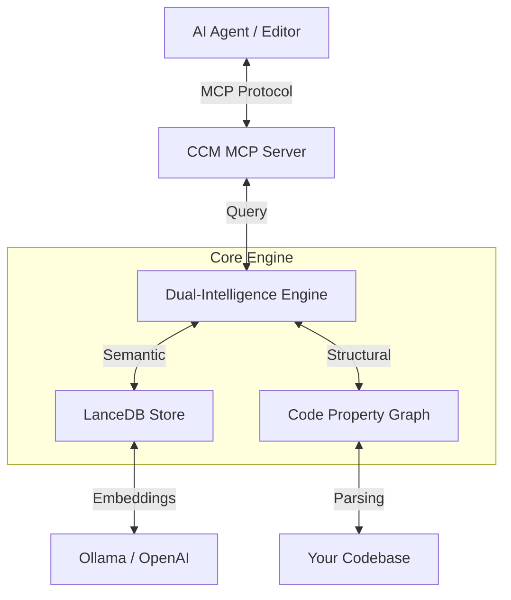

# Cognitive Codebase Matrix (CCM)

> **🧠 The Neural Backbone for Autonomous AI Agents**
>
> **Bridge the gap between your codebase and your AI editor.** CCM transforms static source code into a dynamic, queryable Knowledge Graph, enabling AI agents to navigate, understand, and reason about your project with surgical precision.

[](https://www.rust-lang.org/)
[](https://modelcontextprotocol.io/)
[](https://github.com/senoldogann/LLM-Context-Manager)
[](LICENSE)

---

## 🚀 Why CCM?

Modern AI coding assistants (Claude, Cursor, Windsurf) are powerful, but they suffer from **blindness**:
1.  **Context Limits:** They can't "see" your entire 100,000-line project at once.
2.  **Hallucination:** Without structure, they guess dependencies and imports.
3.  **Lost in Translation:** Traditional vector search finds *similar words*, not *connected logic*.

**CCM gives your AI a map.**
Instead of feeding raw text, CCM provides a **Dual-Intelligence Engine**:
*   **Vector Search (Semantic):** "Find code related to authentication."
*   **Graph Navigator (Structural):** "Who calls `login()`? What does it return? Show me the interface."

It turns your AI from a *text predictor* into a **Senior Architect**.

---

## ✨ Key Features

### 🧠 Connected Intelligence (Graph Navigator)
CCM doesn't just read files; it understands **relationships**.
*   **Two-Pass Indexing:** Automatically links function definitions to their call sites.
*   **Deep Traversal:** Ask "Who calls this?" or "Where is this defined?" and get 100% accurate structural answers.

### ⚡ High-Performance Core
Built entirely in **Rust** for blazing speed.
*   **Batch Embedding:** Indexes thousands of lines in seconds using concurrent batch processing.
*   **LanceDB Integration:** State-of-the-art vector storage for millisecond-latency queries.
*   **Tree-sitter Parsing:** Robust AST analysis for Rust, Python, TypeScript, and JavaScript.

### 🔌 Universal Compatibility (MCP)
Fully implements the **Model Context Protocol (MCP)**.
*   **Plug & Play:** Works instantly with **Antigravity**, **Claude Desktop**, **Zed**, and any MCP-compliant agent.
*   **Auto-Indexing:** Just open your project. CCM handles the rest in the background.

---

## 📦 Installation

### ⚡ Zero-Install (via npx) - *The Ultimate Way*
If you have Node.js installed, you don't even need to build the project. Run CCM instantly:

```bash
# To index your current project:
npx @senoldogann/context-manager index --path .

# To AUTO-CONFIGURE your AI editor (Claude, Antigravity, etc.):
npx @senoldogann/context-manager install

# To start the MCP server manually in your config:
"command": "npx",
"args": ["-y", "@senoldogann/context-manager", "mcp"]
```
*Handles cross-platform binary downloads automatically.*

---

### One-Click Shell Setup (Legacy)
Installs binaries globally to your system via Cargo.
```bash
curl -sSL https://raw.githubusercontent.com/senoldogann/LLM-Context-Manager/main/install.sh | bash
```
*(Requires macOS or Linux. Windows users via WSL.)*

### Manual Build (Development)
```bash
git clone https://github.com/senoldogann/LLM-Context-Manager.git
cd LLM-Context-Manager
cargo build --release
```

---

## 🛠️ Configuration

CCM uses a global configuration file. You don't need to configure it per project.

1.  **Create the config directory:**
    ```bash
    mkdir -p ~/.ccm
    ```

2.  **Create `~/.ccm/.env`:**
    
    **Option A: Local Privacy (Ollama) - _Recommended_**
    ```ini
    EMBEDDING_PROVIDER=ollama
    EMBEDDING_HOST=http://127.0.0.1:11434
    EMBEDDING_MODEL=mxbai-embed-large
    # MAX_TOKENS=1000  # distinct from compilation time limit, optional
    ```

    **Option B: Cloud Power (OpenAI)**
    ```ini
    EMBEDDING_PROVIDER=openai
    EMBEDDING_API_KEY=sk-your-key-here
    EMBEDDING_MODEL=text-embedding-3-small
    ```

---

## 🚀 Workflow: Indexing Your Projects

Before your AI can "see" a project, you must index it. This creates a local `data/` folder inside that project.

**To index a new project:**

```bash
ccm-cli index --path .
```

### 👀 Watch Mode (Automatic Re-indexing)
If you want CCM to automatically update the index whenever you save a file, use the `--watch` flag:

```bash
ccm-cli index --path . --watch
```
*   This scans the project and monitors for changes in `.rs`, `.py`, `.ts`, `.js`, `.tsx`, and `.jsx` files.
*   It uses an intelligent debounce to prevent excessive indexing during rapid edits.

---

## 🤖 Integration Guide (MCP)

CCM uses a **state-of-the-art MCP Server** that works without complex per-project configuration.

### 1. Locate Config File
*   **Antigravity:** `~/.gemini/antigravity/mcp_config.json`
*   **Claude Desktop:** `~/Library/Application Support/Claude/claude_desktop_config.json`

### 2. Add Server Entry
Since CCM binaries are installed globally, you can point to them directly. This setup supports **all projects** automatically.

```json
{
  "mcpServers": {
    "context-manager": {
      "command": "ccm-mcp",
      "args": [],
      "env": {
        "RUST_LOG": "info"
       }
    }
  }
}
```

### 3. Usage in AI
The AI has three main tools to understand your code:

*   **`search_code`**: Semantic search ("Find where we handle auth").
*   **`read_graph`**: Structural navigation ("Who calls this function?").
*   **`get_context`**: Intelligent code reading.

---

## 🎯 Best Practices & Prompting

To get the most out of CCM, follow the **Search → Navigate → Read** workflow.

### 💡 Pro Tips for Users
If the AI gives a "Node not found" error, it's likely trying to guess IDs. Guide it with these prompts:

**Good Sample Prompts:**
*   "First, **search for code** related to repository management in the `mywebsiterepo` project. Then, pick the most relevant service and **read its graph** to show me its callers."
*   "Analyze the `authService.ts` file. Show me its internal structure and then find where these methods are used across the project."
*   "Find all implementations of the `ImpactAnalysis` interface and explain how they connect to the main dashboard."

### 🔧 For AI Agents (Guidelines)
1.  **Never Guess IDs:** Always use `search_code` first to retrieve valid `node_id`s from the results.
2.  **Explicit Paths:** When the user has multiple projects open, always include the `project_path` in your tool calls.
3.  **Context Mapping:** Use `read_graph` to understand *why* a piece of code exists (who depends on it) before suggesting changes.

---

**Pro-Tip: Multi-Project Workflows**
The tools automatically detect the current project context from your editor. If you are working across multiple repositories, the AI can query any indexed project by path.

---

## 🏗️ Architecture

CCM operates as a sidecar process to your editor.



---

## 🧩 Supported Languages

| Language | Extensions | Features |
|:---|:---|:---|
| **Rust** | `.rs` | Full AST, Call Graph, Struct/Impl |
| **Python** | `.py` | Classes, Functions, Imports |
| **TypeScript** | `.ts`, `.tsx` | Interfaces, Types, Functions |
| **JavaScript** | `.js`, `.jsx` | Functions, ES6 Classes |

---

## ❓ Troubleshooting

### "No context found" Error
If `get_context` returns no results:
1.  **Index Your Codebase:** Run `ccm-cli index --path .` at least once.
2.  **Check Empty Lines:** CCM maps functions/classes. Querying a blank line (e.g., between functions) returns nothing by design.
3.  **Project Root:** Ensure the `CCM_PROJECT_ROOT` in your MCP config matches the directory you indexed.

### "Semantic Match" Generic Titles
If search results lack function names:
*   Ensure you are using the latest version (v0.1.0+). Older versions had an ID-mismatch bug.


## 📄 License

Designed for the community. Open source under the **MIT License**.

Built with ❤️ in **Rust**.
