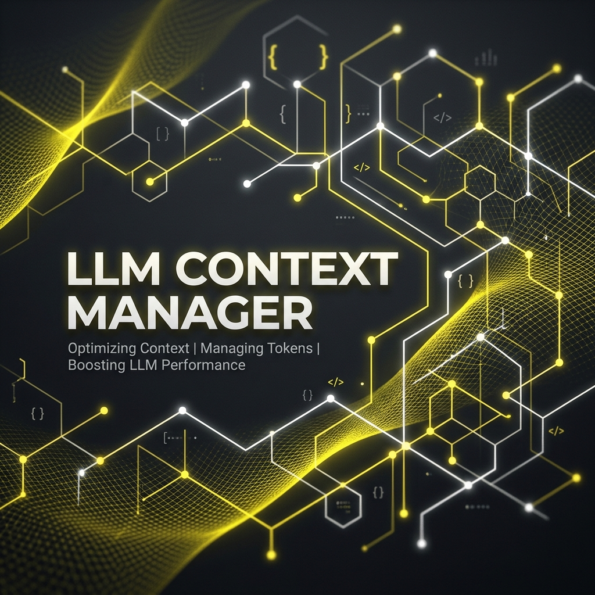

# Cognitive Codebase Matrix (CCM)

<p align="center">
  
</p>

[English](./README.md) | Turkce

> **Yapay zekâ kodlama ajanları için, düzenlemelerinize ayak uyduran ve izlemediği zaman bunu söyleyen bir kod grafı.**

> CCM projenizi tree-sitter ile (13 dil) ayrıştırır, diskte bir çağrı ve import
> grafı ile isteğe bağlı bir anlamsal indeks tutar ve bunları Claude Code, Codex
> ve Cursor gibi ajanlara 10 MCP aracıyla sunar. Django 5.1'de (6.670 dosya)
> kaydedilen bir değişiklik graf sonuçlarında medyan yaklaşık 0,6 sn sonra
> görünür ([ölçüm](https://github.com/senoldogann/LLM-Context-Manager/pull/5):
> release derleme, embedder kapalı). Sorgu yanıtları indeksin durumuyla başlar
> (`fresh`, kaydedilmiş bir değişiklik beklerken `stale · …` ya da
> `auto-refresh off · indexed Xs ago`) ve başarısız bir yeniden indeksleme son
> sağlam grafın yerini asla almaz. Ön-kayıtlı L1 tazelik benchmark'ında (Flask
> 3.0.3 ve Django 5.1'de tek fonksiyonluk düzenlemeler, sabit zamanlı problar)
> kayıttan 0,25 sn sonrasından itibaren her graf cevabı düzenlemeyle uyuştu;
> izleyicinin olayı uygulamasından önceki 250 ms altı pencerede 126 probun 6'sı
> hâlâ `fresh` etiketli düzenleme öncesi cevabı, 4'ü de kısmi ya da boş bir
> cevap döndürdü ([benchmarks/](./benchmarks/README.md)).

> **Durum:** arama kalitesi için 35 görevlik bir pilot benchmark var. Flask ve
> Django üzerinde 24 sabit soruluk, LLM kullanmayan bir benchmark'ta 0.4.0
> araçları 0.3 araçlarına göre %73 daha az cevap baytı ve üçte bir daha az
> çağrıyla cevap veriyor; 164 çağıran konumunun 163'ünü koruyor
> ([token maliyeti](./benchmarks/README.md#token-cost-of-answers-m2)).
> Ajanların görevleri daha hızlı ya da daha az tokenla bitirip bitirmediği henüz
> ölçülmedi. Neyin ölçülüp neyin ölçülmediği:
> [`benchmarks/`](./benchmarks/README.md).

[](https://www.rust-lang.org/)
[](https://modelcontextprotocol.io/)
[](https://github.com/senoldogann/LLM-Context-Manager)
[](LICENSE)
[](SKILL.md)

---

## Neden CCM?

Kodlama ajanları grep ile kodu iyi bulur. Grep'in onlara vermediği şey yapıdır:
bir fonksiyonu kimin çağırdığı, bir değişikliğin neyi bozabileceği, iki yeri
hangi çağrıların bağladığı. CCM bunları graf sorgusu olarak cevaplar
(`find_usages`, `impact_of_change`, `trace_call_chain`) ve siz düzenlerken grafı
güncel tutar:

- **Kayıttan sonra taze:** bir dosya izleyicisi değişiklikleri MCP sunucusunun
  bellekte tuttuğu indekse uygular (Django 5.1'de medyan ~0,6 sn, yalnız graf).
- **İzlemediğinde söyler:** otomatik yenileme kapalıyken yanıtlar
  `auto-refresh off · indexed Xs ago` der. Otomatik yenileme açıkken durum
  satırı yukarıdaki 250 ms altı pencereyi henüz kapsamıyor.
- **Asla yarım değil:** her indeks yeni bir generation olarak kurulur ve atomik
  olarak etkinleştirilir; başarısız ya da yarıda kesilen bir çalıştırma önceki
  grafı hizmette bırakır.

**Sınırlar, baştan.** Python dosyalarında çağrılar ve adın diğer kullanımları
(argümanlar, `User.objects` gibi öznitelik erişimi, tip ipuçları) sözdizimi
ağacından okunur ve dosyanın importları (`import`, `from … import`, göreli
importlar, `from .x import *` dahil paket yeniden dışa aktarımları),
`self`/`cls`/`super()` ve sınıf adlarıyla çözülür;
türü bilinmeyen bir alıcıdaki çağrı en çok beş aynı adlı tanıma *olası* çağrı
olarak raporlanır, projeden çıkan importlar kenar üretmez. Diğer 12 dilde çağrı
kenarları hâlâ isimle çözülür: bir çağrı önce aynı dosyadaki tanıma, yoksa başka
yerdeki tek tanıma bağlanır; aynı dosyadaki birden çok tanım belirsiz olarak
işaretlenmiş kenarlar üretir, birden çok başka dosyada tanımlı bir isim hiç
kenar üretmez. Bunun tür bilen bir araçla
ne sıklıkla örtüştüğü henüz ölçülmedi. Başka MCP sunucuları da kod grafı kurup
otomatik yeniler; CCM bu ölçülene kadar onlardan daha taze ya da daha doğru
olduğunu iddia etmez ([`benchmarks/`](./benchmarks/README.md)).

---

## Temel Ozellikler

### Bağlı Zeka (Graph Navigator)
- **İki Aşamalı İndeksleme** - Fonksiyon tanımlarını çağrı noktalarına bağlar
- **Artırmalı Güncelleme** - İlk çalışmadan sonra yalnızca eklenen, değişen, yeniden adlandırılan veya silinen dosyaları işler
- **Derin Gezinti** - "Bunu kim çağırıyor?" sorusuna grafın bildiği çağıranlarla cevap verir (isimle çözülür, yukarıdaki sınırlara bakın)

### Yüksek Performanslı Çekirdek
- **Rust Tabanlı** - Hızlı indeksleme ve sorgulama
- **Yerleşik Embedding** - Semantik arama kurulumsuz çalışır: sabitlenmiş, çok dilli ve kod üzerinde eğitilmiş bir embedding modeli ikilinin içinde çalışır (Ollama ve API anahtarı gerekmez)
- **Belirlenimci Embedding** - Tüm fiziksel çekirdeklerde çıkarım başına tek parça; bir parçanın vektörü komşularına bağlı olmaz (Ollama/OpenAI istekleri batch'lenir)
- **LanceDB** - Düşük gecikmeli vektör depolama
- **Tree-sitter** - Rust, Python, TypeScript, JavaScript, Go, Java, Kotlin, C#, C, C++, Ruby, PHP ve Swift için sağlam AST analizi

### Production Sertlestirme
- **Binary Checksums** - Release artifact'lari `checksums.txt` ile dogrulanir
- **MCP Allowlist** - `CCM_ALLOWED_ROOTS` ile erisim alani kisitlanabilir
- **Guvenli Varsayilanlar** - Timeout ve dosya boyutu limitleri ayarlanabilir

### Evrensel MCP Uyumlulugu
- **Tak ve Calistir** - Installer, Claude Code, Codex, Cursor, Claude Desktop ve Antigravity ayarlarini yapar
- **Acik Indeksleme** - Eksik indeks hizli hata verir ve `index_project` aracina yonlendirir
- **Dusuk Konfigurasyon** - Proje koku otomatik tespit edilir

---

## Kurulum

### Otomatik Kurulum

```bash
# 1. AI editorunuz icin MCP ayarlarini yapin
npx @senoldogann/context-manager install

# 2. Projeyi indexleyin
npx @senoldogann/context-manager index --path .
```

### Ilk Calistirma Dogrulamasi

Kurulumdan sonra mutlu yolu hizlica dogrulayin:

```bash
# CLI cevap veriyor mu kontrol et
npx @senoldogann/context-manager query --text "src/main.rs:1"

# MCP server'i dogrudan baslat
npx @senoldogann/context-manager mcp
```

Beklenen sonuc:
- Wrapper, isletim sistemi ve mimariye uygun binary'yi indirir
- `index`, proje icinde `data/ccm_db` olusturur
- `mcp`, JSON-RPC parse hatasi vermeden stdio uzerinde beklemeye gecer

### Editor Uyumlulugu

| Host | Durum | Kurulum Yolu |
|------|-------|--------------|
| Claude Code | Destekleniyor | `claude mcp add-json --scope user` (`claude` CLI gerekir) |
| Codex | Destekleniyor | `~/.codex/config.toml` atomik olarak güncellenir |
| Cursor | Destekleniyor | `~/.cursor/mcp.json` |
| Claude Desktop | Destekleniyor | Yerel desktop config |
| Antigravity | Destekleniyor | Yerel host config |

Editor otomatik tespit edilmezse installer'in verdigi manuel MCP config'i kullanabilirsiniz.

### 🤖 Ajan Skill'i

CCM, kaynak repoda ve npm paketinde yaklaşık 4 KB'lık bir [`SKILL.md`](SKILL.md) ile gelir. Dosya, 10 MCP aracından hangisinin hangi soruyu cevapladığını, `map` → `explain` → `impact_of_change` akışını ve cevap bütçelerini anlatır; bir `CLAUDE.md` parçası ve proje haritasını yükleyen bir SessionStart hook örneği içerir.

Ajan skill dizininize kopyalayin, birinci sinif arac referansi olarak kullanin:
```bash
cp SKILL.md ~/.agents/skills/context-manager/SKILL.md
```

### Manuel Derleme (Rust)

```bash
# Lokal source build hata verirse once protoc kurun.
# macOS: brew install protobuf

git clone https://github.com/senoldogann/LLM-Context-Manager.git
cd LLM-Context-Manager
cargo build --release
```

**Rust kurmadan mi?** [GETTING_STARTED.md](GETTING_STARTED.md) icindeki Docker secenegini kullanin.

### Manuel npm yayini (maintainer)

`package.json` repo kokunde degil, bilerek `npm/` dizinindedir:

```bash
cd npm
npm test
npm pack --dry-run
npm publish --access public --provenance
```

---

## Konfigurasyon

Semantik arama icin ayar gerekmez: varsayilan yerlesik yerel embedding
modelidir (bkz. [Embedding](#embedding)). `~/.ccm/.env` dosyasini (veya repodaki
`.env.example` dosyasini) yalnizca varsayilanlari degistirmek icin olusturun:

```ini
# Varsayilan: yerlesik yerel model, ayar gerekmez.

# Secenek B: Ollama
EMBEDDING_PROVIDER=ollama
EMBEDDING_HOST=http://127.0.0.1:11434
EMBEDDING_MODEL=mxbai-embed-large

# Seçenek C: OpenAI. Bu tek satır onu seçer; kod parçaları OpenAI'a gönderilir.
OPENAI_API_KEY=sk-your-key

# Ag ve limitler
EMBEDDING_TIMEOUT_SECS=30
CCM_MAX_FILE_BYTES=2097152

# MCP guvenligi (strict allowlist varsayilan olarak ACIK)
CCM_ALLOWED_ROOTS=/Users/you/projects:/Users/you/sandbox
CCM_REQUIRE_ALLOWED_ROOTS=1

# MCP runtime
CCM_MCP_ENGINE_CACHE_SIZE=8
CCM_MCP_DEBUG=0

# Opsiyonel: embedding'i kapat
CCM_DISABLE_EMBEDDER=0

# Opsiyonel: md/json/yaml dosyalarını vektör aramaya dahil et
CCM_EMBED_DATA_FILES=0

# Binary checksum dogrulama (0 = zorunlu, 1 = bypass)
CCM_ALLOW_UNVERIFIED_BINARIES=0

# Opsiyonel indirme ayarlari
CCM_DOWNLOAD_TIMEOUT_MS=120000
CCM_DOWNLOAD_ATTEMPTS=3
```

Gelismis ayarlar:
- `CCM_PROJECT_ROOT` varsayılan proje kökünü sabitler ve host'un bildirdiği çalışma alanını ezer. Verilmezse MCP sunucusu varsayılan projeyi şu sırayla çözer: host'un MCP `roots` ile bildirdiği çalışma alanı → `CCM_ALLOWED_ROOTS` içindeyse başlatma dizini (asla `/` veya ev dizini değil) → tek `CCM_ALLOWED_ROOTS` girdisi.
- `CCM_DB_PATH`, varsayılan MCP vektör veritabanı konumunu değiştirir.
- Chunking, batch size, hibrit agirliklar ve `OPENAI_API_KEY`, `CCM_SKIP_CHECKSUM`, `CCM_MCP_REQUIRE_ALLOWED_ROOTS`, `CCM_EMBED_DATA`, `EMBEDDING_DISABLED` gibi uyumluluk alias'lari icin `.env.example` dosyasina bakin.
- Hibrit skor agirliklari icin [`docs/hybrid-ranking.md`](./docs/hybrid-ranking.md) dosyasini kullanin.

### Embedding

**Varsayılan: yerleşik yerel model.** `EMBEDDING_*` ayarı yoksa ve `~/.ccm/.env`
içinde `OPENAI_API_KEY` bulunmuyorsa CCM kodu süreç içinde
[`ibm-granite/granite-embedding-97m-multilingual-r2`](https://huggingface.co/ibm-granite/granite-embedding-97m-multilingual-r2)
ile (Apache-2.0; IBM'in int8 ONNX dosyası, 384 boyut, CLS pooling, girdiler 512
token'da kesilir) ONNX Runtime üzerinden, fiziksel çekirdeklerle embed eder.

- **İndirme:** ilk indeksleme (ya da `ccm-cli models pull`) Hugging Face'ten
  sabitlenmiş bir revizyondan ~124 MB (98 MB model + 25 MB tokenizer + ayarlar)
  indirir: `~/.ccm/models/ibm-granite--granite-embedding-97m-multilingual-r2/<revizyon>/`.
  Her dosya sabitlenmiş SHA-256 ile doğrulanır; uyuşmazlık ya da başarısız indirme
  açık bir hatadır, sessiz geri dönüş yoktur. Yalnızca model indirilir; kodunuz
  makineden çıkmaz.
- **Ağsız kurulum:** bağlı bir makinede `ccm-cli models pull` çalıştırıp
  `~/.ccm/models` dizinini kopyalayın; önceden yerleştirilen dosyalar doğrulandıktan
  sonra kullanılır. `CCM_MODEL_DIR` model kökünü, `HF_ENDPOINT` aynayı değiştirir.
- **Ayar:** `CCM_EMBED_THREADS` (varsayılan: fiziksel çekirdek sayısı; container'daki
  cgroup sınırı gibi kullanılabilir CPU kotasıyla sınırlanır). Model
  çıkarım başına tek parça embed eder: int8 aktivasyonları çağrı başına quantize
  edildiğinden batch'leme bir parçanın vektörünü aynı çağrıdaki parçalara bağlı
  kılardı. `CCM_LOCAL_EMBED_BATCH` yerel çıkarım batch'ini ayarlar (varsayılan 1);
  `CCM_EMBED_BATCH_SIZE` Ollama/OpenAI isteği başına metin sayısını belirler
  (varsayılan 32).
- **Intel Mac (`x86_64-apple-darwin`):** ONNX Runtime bu hedef için hazır ikili
  yayımlamadığından yerel model derlenmez. `~/.ccm/.env` içine `OPENAI_API_KEY`
  eklenene ya da `EMBEDDING_PROVIDER` verilene kadar CCM graf-yalnız indeks kurar;
  `ccm-cli doctor` ve indeksleme çıktısı nedenini söyler.

**İsteğe bağlı yükseltme: OpenAI.** `~/.ccm/.env` içine `OPENAI_API_KEY=sk-...`
eklerseniz CCM, resmi `https://api.openai.com/v1` endpoint'inde
`text-embedding-3-small` ile embed eder; bu endpoint için
`CCM_ALLOW_REMOTE_EMBEDDING` onayı gerekmez. Bu durumda kod parçaları OpenAI'a
gönderilir. Yalnızca `~/.ccm/.env` içindeki anahtar sayılır: kabukta export
edilmiş bir anahtar sağlayıcıyı asla değiştirmez, böylece kod açık bir tercih
olmadan makineden çıkmaz. [`benchmarks/`](./benchmarks/README.md) yerleşik modelle
karşılaştırmayı içerir.

**Sağlayıcı seçimi:** `EMBEDDING_PROVIDER=local|ollama|openai` verilmişse o
kullanılır. Verilmemişse `~/.ccm/.env` içindeki `OPENAI_API_KEY`, `EMBEDDING_HOST`
ayarlı değilse OpenAI'ı seçer (`EMBEDDING_MODEL` bu durumda yalnızca OpenAI
modelini belirler). Bu anahtar yokken `EMBEDDING_HOST` ya da `EMBEDDING_MODEL`
ayarlıysa önceki Ollama/OpenAI davranışı korunur (mevcut yapılandırmalar
değişmeden çalışır); hiçbiri yoksa yerel model kullanılır.
`CCM_DISABLE_EMBEDDER=1` semantik aramayı kapatır.

**Model değişikliği:** indeks manifesti vektörleri üreten sağlayıcı, model,
revizyon ve boyutu kaydeder; iki modelin vektörleri asla karışmaz. Değişiklikten
sonra (0.3.x'ten yükseltmede Ollama ile kurulmuş indeksin yeni yerel varsayılanla
karşılaşması dahil) MCP sunucusu etkin indeksi arka planda bir kez yeniden embed
eder (tazelik satırı `semantic index being rebuilt` der; otomatik yenileme bu
sırada grafı güncel tutar ve `search_code` o bitene kadar graf sonuçlarını
kullanır). `ccm-cli index` /
`index_project` aynı işi istendiğinde yapar.

Embedding kaynağına ulaşılamazsa (Ollama ya da OpenAI erişilemez, model
indirilemedi) indeksleme
yine de graf-yalnız bir indeks aktive eder (graf araçları çalışır, `search_code`
sözcüksel eşleşmeye düşer) ve nedenini raporlar; sonraki indeksleme vektörleri
tamamlar. `ccm-cli doctor` embedder durumunu raporlar: yerel modelde dosyaları
indirmeden denetler ve bir deneme embedding'i yapar; Ollama/OpenAI'de gerçek bir
deneme isteği gönderir.

**Guvenlik:** MCP varsayilan olarak strict allowlist uygular; yalnizca `CCM_ALLOWED_ROOTS` (yoksa `CCM_PROJECT_ROOT`) altindaki dizinler ve host'un MCP `roots` ile bildirdigi calisma alanlari indekslenebilir/okunabilir. Genis erisim gerekiyorsa `CCM_REQUIRE_ALLOWED_ROOTS=0` verilebilir; bu modda bile erisim baslangic proje kokuyle sinirli kalir.

---

## Kullanim

### CLI Komutlari

```bash
# Projeyi indexle
ccm-cli index --path .

# Proje haritası: dosyalar, diğer dosyaların onları ne kadar kullandığına göre
ccm-cli map --path .

# Semantik arama
ccm-cli query --text "authentication logic"

# Cursor tahmini (file:line format)
ccm-cli query --text "src/main.rs:50"

# Watch mode
ccm-cli index --path . --watch

# Kurulum, allowlist, index uyumlulugu ve embedder durumunu denetle
ccm-cli doctor --path .

# Yerlesik embedding modelini onceden indir ve dogrula
ccm-cli models pull

# Degerlendirme calistir
ccm-cli eval --tasks eval/golden_tasks.v3.ccm.json
```

### MCP Tool'lari

| Araç | Cevapladığı soru | Örnek |
|------|------------------|-------|
| `map` | Projede ne var, en önemlisi hangisi | `map {path:"src"}`: dosyalar diğer dosyalardaki kullanımlarına göre, en çok kullanılan sembolleriyle |
| `explain` | Bir sembol hakkında her şey, tek çağrıda | `explain {target:"Engine.start"}`: tanım, gövde, üyeler, çağıranlar, çağrılanlar, testler |
| `find_usages` | Bir sembolü kim, nasıl kullanıyor | "Bu fonksiyonu kim çağırıyor?" |
| `impact_of_change` | Bir dosya değişirse ne bozulabilir | Kod tabanındaki bağımlılar |
| `search_code` | Anlama ya da ada göre kod | "Auth handling'i bul" |
| `find_nodes` | Ada ya da yola göre semboller | `find_nodes {query:"UserService"}` |
| `trace_call_chain` | Bir sembol diğerine nasıl ulaşıyor | `from` → `to` yolu |
| `diff_context` | Git'e göre son değişen kod | Son N günün değişiklikleri |
| `index_project` | Proje indeksini yenile | Artımlı; `mode:"quick"` embedding'leri arka plana bırakır |
| `index_now` | İndeksle ve son istatistikleri bekle | `mode:"quick"`, `"full"` ya da `"upgrade"` |

Her sonuç tek satırdır: `- Tür: ad · yol:başlangıç-bitiş · ilişki`. `target` bir
ad (`run`, `Engine.start`), dosya yolu, `yol:satır` (sonuçtaki
`yol:başlangıç-bitiş` de olur) ya da düğüm kimliği alır; belirsiz bir ad
adaylarını döndürür. Her graf aracı `max_tokens` alır (varsayılan 1500, `map`
için 1000) ve sığmayan sonuç sayısını söyler.

> **0.4.0 (uyumsuz değişiklik):** `get_context` ve `read_graph` yerini
> `explain`'e bıraktı. Graf araçları düğüm kimliği içermeyen kompakt tek satırlık
> sonuçlar döndürür ve `max_chars` yerine `max_tokens` bütçesi alır (`max_chars`
> hâlâ karakter / 4 olarak kabul edilir); hedef olarak `yol:satır` verin.

### Arttirmali indexleme davranisi

İlk `index` tüm projeyi indeksler. Sonraki `index_project` veya `index --watch` çalışmaları dosya manifestini karşılaştırır; yalnızca yeni ya da değişen dosyaları günceller ve silinen dosyaların node'larını kaldırır. Hiçbir şey değişmediyse vektör veritabanı baştan oluşturulmaz. İndeks eksikse veya güncelleniyorsa retrieval araçları hızlı hata verir; arama çağrısını gizli bir yeniden oluşturma işlemi için bekletmek yerine `index_project` açıkça çağrılır.

Büyük repolarda MCP `index_project`, istemci zaman aşımından önce yanıt verir ve
indeksleme arka planda sürer. Son indeksleme istatistikleri gelene kadar aynı
aracı tekrar çağırarak durumu sorgulayabilirsiniz.

Tam yeniden oluşturma önce staging neslinde hazırlanır. Tarama, ayrıştırma,
embedding veya vektör yazma hatası önceki graf, manifest ve vektör tablosunu
yerinde bırakır. Dosya parmak izleri içeriği de kapsadığı için boyutu aynı kalan
ve zaman damgası korunmuş değişiklikler algılanır.

---

## Mimari

```
┌─────────────┐     ┌─────────────┐     ┌─────────────┐
│ AI Agent    │────▶│ MCP Server  │────▶│ Core Engine │
│ (Codex vb.) │◀────│ (ccm-mcp)   │◀────│ (Rust)      │
└─────────────┘     └─────────────┘     └─────────────┘
                                                  │
                    ┌────────────────────────────┼────────────────────────────┐
                    ▼                            ▼                            ▼
             ┌─────────────┐            ┌─────────────┐            ┌─────────────┐
             │ Code Graph  │            │  Vector DB  │            │  Parser     │
             │ (Petgraph)  │            │  (LanceDB)  │            │(Tree-sitter)│
             └─────────────┘            └─────────────┘            └─────────────┘
```

---

## Desteklenen Diller

| Dil | Uzanti | Analiz |
|-----|--------|--------|
| Rust | `.rs` | Tam AST |
| Python | `.py` | Tam AST |
| TypeScript | `.ts`, `.tsx` | Tam AST |
| JavaScript | `.js`, `.jsx` | Tam AST |
| Go | `.go` | Tam AST |
| Java | `.java` | Tam AST |
| Kotlin | `.kt`, `.kts` | Tam AST |
| C# | `.cs` | Tam AST |
| C | `.c`, `.h` | Tam AST |
| C++ | `.cc`, `.cpp`, `.cxx`, `.hh`, `.hpp`, `.hxx` | Tam AST |
| Ruby | `.rb`, `.rake`, `.gemspec` | Tam AST |
| PHP | `.php`, `.phtml` | Tam AST |
| Swift | `.swift` | Tam AST |
| Config/Data | `.md`, `.json`, `.yaml` | Tam dosya |

---

## Degerlendirme

CCM, golden task tabanli bir evaluation framework ile gelir:

```bash
# Evaluation calistir
ccm-cli eval --tasks eval/golden_tasks.v3.ccm.json

# Structural vs hybrid karsilastir
ccm-cli eval --tasks eval/golden_tasks.v3.ccm.json --compare
```

Evaluation index'i yoksa CCM skorlama oncesi otomatik hazirlar.
Semantik `search_code` gorevleri icin embedder gerekir.

**Kayitli sonuclar:** [`eval/`](./eval) altindaki raporlara bakin.

---

## Release Guvenilirligi

CCM release akisinda kurulum guvenilirligi icin su noktalar yer alir:

- GitHub Releases, platform binary'leri ve `checksums.txt` yayinlar
- npm wrapper, indirilen binary'leri ilk kullanimdan once dogrular
- MCP transport request size limit uygular ve debug payload'larda hassas degerleri maskeler
- Release workflow, asset yuklemeden once Linux, macOS ve Windows build'lerini alir
- npm yayini, GitHub Release asset'lari tamamlandiktan sonra `npm/` dizininden manuel yapilir
- README quick-start adimlari ilk kurulum smoke test akisi ile aynidir

Lokal source build icin `cargo build --release` komutu halen makinenizde `protoc` kurulu olmasini gerektirir.

---

## Sorun Giderme

### "No context found"
1. Once `ccm-cli index --path .` calistirin
2. Override ettiyseniz `CCM_PROJECT_ROOT` degerinin indexlenen dizinle ayni oldugunu kontrol edin
3. Embedder durumunu `ccm-cli doctor` ile denetleyin (yerel model dosyalari ya da Ollama/OpenAI servisi)

### Yavas indexleme
- Ilk calisma yerel embedding modelini bir kez indirir (~124 MB); `ccm-cli models pull` onceden indirir
- Sonraki calismalar incremental oldugu icin daha hizlidir

### "Checksum manifest not found" / "Checksum mismatch"
1. GitHub release icinde `checksums.txt` oldugunu kontrol edin
2. Kurulumu tekrar deneyin
3. Son care olarak `CCM_ALLOW_UNVERIFIED_BINARIES=1` kullanin

### "Project path is not allowed"
- Strict allowlist modu varsayilan olarak aktiftir
- `CCM_ALLOWED_ROOTS` icine proje kokunu ekleyin
- Gercekten gerekiyorsa `CCM_REQUIRE_ALLOWED_ROOTS=0` kullanin (erisim yine baslangic proje kokuyle sinirli kalir)

### Büyük veya binary dosyalar atlanıyor
- Gerekirse `CCM_MAX_FILE_BYTES` degerini artirin

### Data dosyalari search'te gorunmuyor
- Varsayilan olarak `.md`, `.json`, `.yaml` dosyalari indexlenir ama embed edilmez
- `CCM_EMBED_DATA_FILES=1` ile semantik aramaya dahil edebilirsiniz

---

## Kaynaklar

- **NPM Paketi:** [@senoldogann/context-manager](https://www.npmjs.com/package/@senoldogann/context-manager)
- **English README:** [README.md](./README.md)
- **Baslangic Rehberi:** [GETTING_STARTED.md](./GETTING_STARTED.md)
- **Ornek Ortam Dosyasi:** [.env.example](./.env.example)
- **Hybrid Ranking Notlari:** [docs/hybrid-ranking.md](./docs/hybrid-ranking.md)
- **Katki:** [CONTRIBUTING.md](./CONTRIBUTING.md)

---

## Yildiz Gecmisi

[](https://star-history.com/#senoldogann/LLM-Context-Manager&Date)

---

## Lisans

MIT License - Acik kaynak ve ucretsiz.
