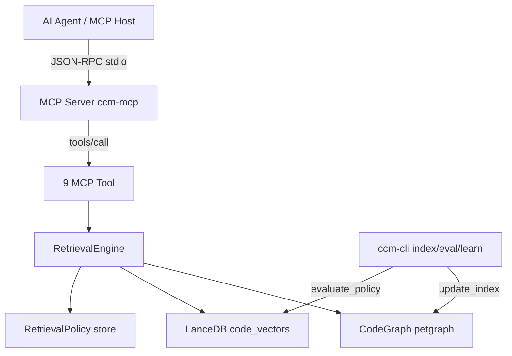

# Bilişsel Kod Matrisi (CCM): Teorik Temeller ve Gerçekleşen Mimari

> Bu belge, CCM'nin tasarım hedeflerini **mevcut implementasyonla** birlikte anlatır.
> "İddia" olarak etiketlenen bölümler hedeftir; "Gerçek" olarak etiketlenenler
> v0.3.3'te çalışan davranıştır. Ayrım, dokümantasyonun kodun önüne geçmemesi
> için bilinçlidir.

## 1. Giriş: Bağlam Penceresi Paradoksu

Büyük Dil Modelleri (LLM) güçlüdür ancak bağlam pencereleri sınırlıdır ve
"ortada kaybolma" (lost-in-the-middle) etkisi geri getirme kalitesini düşürür.
CCM, bağlamı genişletmek yerine **neyin bağlama gireceğini** yöneten bir ara
katmandır: statik kod analizi (AST + cross-reference graph) ve anlamsal geri
getirim (embeddings + hybrid ranking).

## 2. Gerçekleşen Mimari

### 2.1 Kod Temsili: AST + Cross-Reference Graph (CPG değil)

**İddia (hedef):** Kod Property Graphs (AST + CFG + PDG) tam türetmek.

**Gerçek (v0.3.3):** CCM, tree-sitter ile her dilin **AST**'sini çıkarır ve
`petgraph` üzerinde **cross-reference graph** kurar. Grafik düğümleri
(Function/Method/Class/Struct/Module/File) ve kenarları şunlardır:

- `Calls` — çağrı ilişkisi (name-match tabanlı, Phase 1'de scope-resolved
  çözümlemeye geçiş planlıdır)
- `Imports` — modül/dosya importları
- `Contains` — dosya → sembol hiyerarşisi
- `Inherits` — sınıf kalıtımı
- `Reads` / `Writes` — sembol okuma/yazma ilişkileri (heuristic)

CFG ve PDG **mevcut değildir**; veri/control-flow bağımlılığı iddiası
yapılmaz. "Bu değişken nerede tanımlandı?" gibi sorular her zaman %100
deterministik cevaplanmaz; kenarların bir kısmı heuristic'tir ve
`reason` alanında kaynağı belirtilir.

### 2.2 Bellek Katmanları

**İddia:** Uzun süreli / çalışma / episodik bellek ayrımı.

**Gerçek:** İki kalıcı katman vardır:

- **Uzun süreli:** `data/ccm_graph.json` (graph) + LanceDB vektör deposu
  (`data/ccm_db`) + incremental manifest.
- **Çalışma belleği:** `get_context` / `predict_context` ile imleç etrafındaki
  aktif düğümler.

"Episodik bellek" (kullanıcı etkileşimi geçmişi) **henüz yoktur**; v0.3.2'de
eklenen `CCM_TRAJECTORY_LOG` (observable retrieval event'leri) bu yönde ilk
adımdır ve Phase 3'te gerçek feedback'e bağlanması planlanır.

### 2.3 Spekülatif Geri Getirim (Speculative Retrieval)

**İddia:** IDE imleci/sekmeleri izleyip arka planda bağlam hazırlama.

**Gerçek:** VS Code extension, daemon, gRPC veya cursor/sekmeleri izleme
**mevcut değildir**. Bunun yerine MCP stdio üzerinden isteğe bağlı
`get_context(file, line)` çağrısı, imleç pozisyonuna göre mevcut fonksiyonu ve
komşularını döndürür (isteğe bağlı prefetch değil, senkron retrieval).

## 3. Gerçek Bileşenler ve Akış

Dağıtım: `ccm-cli` (CLI), `ccm-mcp` (MCP stdio sunucusu), `ccm-core`
(paylaşılan kütüphane), npm wrapper (binary indirme + host kurulumu).

## 4. Retrieval ve Öğrenme

- **Hybrid ranking:** `score = w_g*graph + w_s*semantic + w_spatial*spatial +
  w_r*recency`; ağırlıklar `RetrievalPolicy`'de versioned'dır (baseline =
  üretim varsayılanları).
- **Self-improvement (Phase 1):** `ccm-cli learn {fixtures,optimize,report}`
  deterministik sentetik corpus üzerinde policy adaylarını train'de optimize
  eder, holdout'ta promotion gate'ten geçirir. Evaluator optimizasyon sırasında
  dokunulmaz; `Rejected` bilimsel sonuçtur, CI kırmızısı değildir.
- **Kanıt sınırı:** Şu ana kadarki en güçlü kanıt *yapısal* golden task'lardır
  (deterministik). Gerçek anlamsal (embedder) geri getirim kalitesi Phase 2'de
  gerçek repo'larla ölçülecek; bu belge o tamamlanana kadar anlamsal başarı
  iddiası taşımaz.

## 5. İddia vs Gerçek Özeti

| İddia | Gerçek (v0.3.3) |
|---|---|
| CPG (AST+CFG+PDG) | AST + cross-reference graph (Calls/Imports/Contains/Inherits/Reads/Writes) |
| Daemon + gRPC + VS Code extension | CLI + MCP stdio server |
| Spekülatif cursor izleme | Senkron `get_context(file, line)` |
| Episodik bellek | Trajectory log (v0.3.2+, Phase 3'te feedback'e bağlanacak) |
| Hybrid retrieval | Evet, policy versioned |
| Self-improvement | Phase 1 proof-of-mechanism; gerçek repo kanıtı Phase 2'de |

## 6. Sonuç

CCM, kod tabanını sorgulanabilir bir grafiğe dönüştürüp ajanlara token-verimli,
deterministik ve izlenebilir bağlam sunmayı hedefler. Bu doküman, hedef ile
implementasyon arasındaki makası kapatmak için "iddia" ve "gerçek" ayrımını
açık tutar; her yeni sürümde bu tablo güncellenmelidir.
